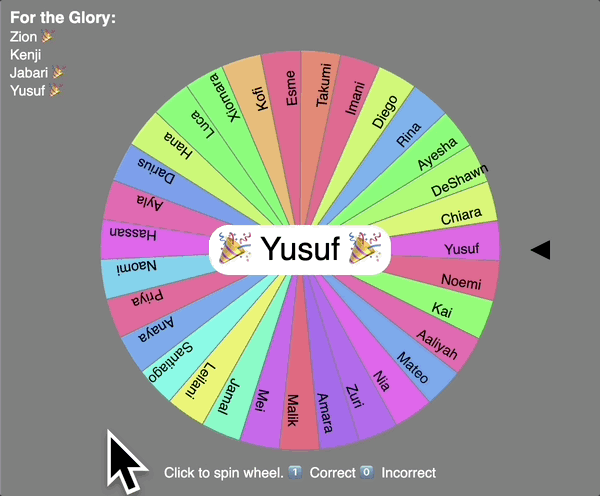

# Random Student (Spinner Wheel)

Students generally **DO NOT LIKE** being cold-called (being asked to answer a question in front of the class, without volunteering). So, we must [warm up the practice](https://evidencebased.education/five-tips-for-cold-calling-in-the-classroom/). We can establish the practice of cold-calling as an **expected routine** (so that students can prepare), and we can build a supportive classroom that puts positive, collective pressure on the the **routinized task of retention** for certain knowledge.

## How does it work?

This tool is a [colorful wheel](https://domlet.github.io/spinner) that a group facilitator can spin to randomly choose one student from a group.

When a chosen student gives an answer, the facilitator can press the `1` key to **reward a correct answer** with a 🎉 emoji and an upbeat chime, or press `0` to invite another student's attempt. _The score is not saved._



## Design specifications

Like this [soundboard](https://domlet.github.io/soundboard8x8), the spinner is designed to stimulate neurochemicals (dopamine, oxytocin, and acetylcholine) to enhance students' **attention, engagement, social bonding, and retention**.

_The spinner is designed to be..._

1. **Random** – to avoid teachres' unconscious bias.
1. **Non-duplicative** – so each student may be selected only once.
1. **Non-verbal** – to engage students' sensory processing.
1. **Adaptible** – so teachers can switch between multiple groups.
1. **Private** – to keep students' names unpublished (offline).

## Who created it?

Original creators like [schellenberg](https://editor.p5js.org/schellenberg/sketches/_Ers-90T_) and [Q](https://editor.p5js.org/Q/sketches/07UvXkBLV) published 'spinning wheel' sketches on p5js, which ChatGPT likely ingested to understand my original prompt:

> _Write a p5js app that takes a list of names (any length) and generates a circle with that number of multicolored slices, with each name written inside a slice with the baseline of the text following a line from the center of the circle to the edge. The last letter of each name should be 6px from the circle's outside edge. put a black triangle pointing at the very top of the circle in the center.<br><br>When the user hits any key or clicks on the screen, the circle and names should spin clockwise quickly at first, and then slowly, ultimately stopping with one specific name at the top. there should be a clicking noise that plays every time 5 names pass the black triangle._

I did about two days' work refining the app while on summer vacation, and then published the [repo on GitHub](https://github.com/domlet/spinner) and posted the [working demo](https://domlet.github.io/spinner).

Atrributions for the 4 sounds are as follow:

- **Correct chime** – [collect.wav](https://freesound.org/s/325805/) by Wagna
- **Incorrect chime** – [Dat's Wrong!](https://freesound.org/s/587253/) by Beetlemuse
- **Spin click** – [Cartoon sounds](https://developers.google.com/assistant/tools/sound-library/cartoon) for Google Assistant
- **Selection sound** – [Cartoon sounds](https://developers.google.com/assistant/tools/sound-library/cartoon) for Google Assistant

Anyone can use this tool. It costs nothing to download, copy, publish or modify.

<a href="https://github.com/domlet/spinner">Random Student (Spinner Wheel)</a> © 2025 by <a href="https://domlet.github.io/about">Dom Brassey (@domlet)</a> is licensed under <a href="https://creativecommons.org/licenses/by-nc/4.0/">CC BY-NC 4.0</a>

## Instructions for use

1. **The easiest way** is to replace the names in [this p5js sketch](https://editor.p5js.org/domlet/sketches/G3FnfFgth) and run the tool in your web browser. But that is not best practice for keeping student information (like first and last names) private. Compromising our students' privacy can risk the safety of children and families with citizenship or other insecurities in a surveillance state. (So please don't.)

1. **The safest way** is to follow these steps ([watch this video]())...

   1. [Download the project from p5js](https://editor.p5js.org/domlet/sketches/G3FnfFgth) or [the GitHub repo](https://github.com/domlet/spinner) and save it your computer. You can run the app locally, even without an Internet connection.

   1. Then, open `sketch.js` and add each of your groups at the top of that file as lists ([arrays](https://www.w3schools.com/js/js_arrays.asp)), like this example, which shows two lists called `period1` and `period2`:
      ```js
      const period1 = ["Aaliyah", "Mateo", "Nia", "Kenji"];
      const period2 = ["Jana", "Mahlia", "Scott", "Eduardo"];
      ```
   1. When you want to switch to a specific group, scroll down to find where the value of `names` is assigned. It will look like this:
      ```js
      let names = period1;
      ```
   1. On that line, change only the value **on the right side** of the equals sign (`=`), like this:

      ```js
      let names = period2;
      ```

   1. When you save your changes to `sketch.js` and reload your `index.htm` file in your web browser, your spinner should show the updated group of names.
   1. To run the app, I use [Visual Studio Code](https://code.visualstudio.com/download) IDE with the [Live Server extension](https://ritwickdey.github.io/vscode-live-server/) – but you can also use these options:

      **Python:**

      ```bash
      python3 -m http.server
      ```

      **Node.js:**

      ```bash
      npx http-server
      ```

   1. **Need help?** Here's a [short video]() demonstrating how to follow the steps above.

1. It goes without saying that anyone can [copy the p5js project](https://editor.p5js.org/domlet/sketches/G3FnfFgth) or [fork]() this repo and modify your own versions for all to see. :)

## Further development

_Thinking about adding..._

1. Battle mode: Ability to **recognize teams within the group** (such as `Team 1` vs `Team 2`).
1. Enhanced scoring: Ability to **track students' points over the term** – probably with a simple SQL database.

However, the app without these features hits the sweet spot of being dead simple and easy to use or make simple changes to. So I may change nothing!

## Questions or comments?

I would love to know In invite you to add an issue for [this repository](https://github.com/domlet/spinner) or email me at dom.brassey@ousd.org. Buy me a coffee here or learn more about me [on my blog](https://domlet.github.io/about). 👍🏼
